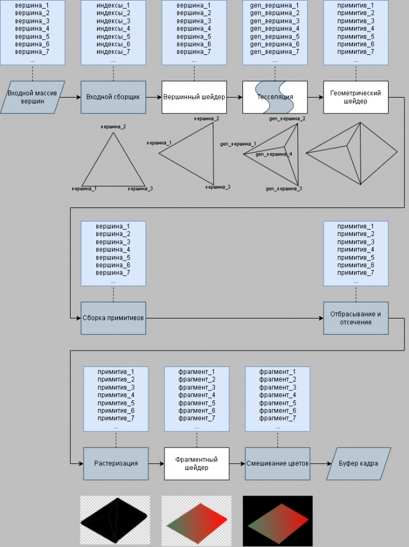

# Графический Конвеер

> [!TIP]
> Тут я постараюсь описать весь путь отрисовки кадра\
> В этой главе только теория, код дальше\
> Слово "авто" будет обозначать, что процесс автоматический и управлять им нельзя

Графический Конвеер ↓\

1. Входной массив вершин:\
В такой массив заносят декартовы координаты вершин фигуры,\
которую собираются нарисовать. Вершина при этом представляет\
собой набор данных поверх 3D-координаты. Часто у вершины есть и другие характеристики:\
нормаль, один или несколько цветов, координаты текстуры и так далее

> [!TIP]
> В openGL этот массив загружается в память видеокарты\
> Как создовать этот массив написанно в главе "МАССИВ ВЕРШИННЫХ ОБЪЕКТОВ"

2. Входной сборщик(авто):\
компонует вершины для создания полигонов из\
МАССИВА ВЕРШИННЫХ ОБЪЕКТОВ

3. Вершинный шейдер:\
вызывается для каждой вершины и осуществляет преобразования координат\
Что за преобразования? Объясняю:\
OpenGL хоть и 3D библиотека, но буфер кадра в котором происходит рисование\
является 2D. То есть openGL рисует только 2D.\
Ось Z используется в буфере глубины и отвечает за то,\
какой примитив поверх какого рисовать. Ось Z на положение ни как ни влияет\
По этому используя матрицы в шейдере, мы можем проецировать 3D(x, y, z) на 2D(x, y)

4. тесселяция(пока что не реализовано):\
позволяет увеличить количество полигонов и состоит из нескольких шагов:\
+ управляющий шейдер — подготовка параметров тесселяции,
+ генерация примитивов — использует параметры для разбиения\
примитивов на множество мелких,
+ вычислительный шейдер — работает аналогично вершинному шейдеру\
  и вызывается для каждой вершины, образованной на шаге генерации примитивов

5. геометрический шейдер(пока что не реализован):\
обрабатывает и изменяет примитивы (треугольники, линии, точки);

6. сборка примитивов(авто):\
группировка вершин, созданные предыдущими шейдерами в примитивы, подходящие для растеризации;

7. отсечение и отбрасывание(авто):\
определение частей примитивов, влияющих на результат изображения (отбрасываются невидимые примитивы);

8. растеризация(авто):\
преобразование примитивов к фрагментам, которые становятся пикселями

9. фрагментный шейдер:\
вызывается для каждого фрагмента и определяет в какие фреймбуферы\
и с каким значением цвета записываются фрагменты.

10. смешивание цветов(авто):\
совмещение различных фрагментов и выходного буфера с учетом прозрачности.

+ [дальше](vao.md)
+ [назад](window.md) 
+ [в оглавление](manual.md)
