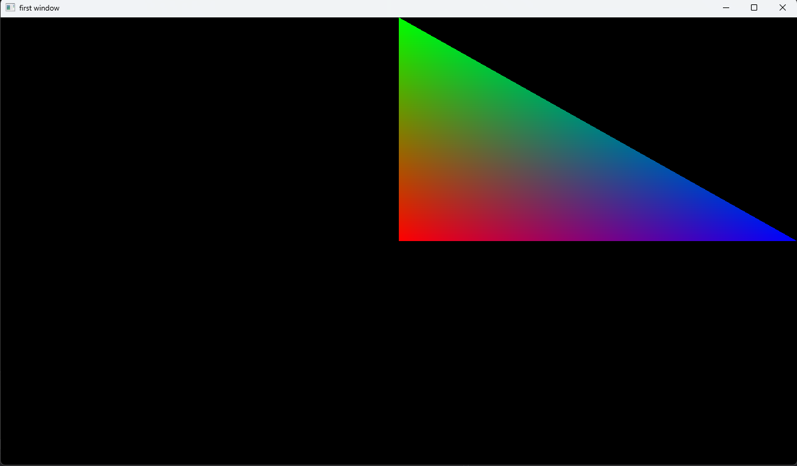

# Вершинный атрибуты

для начала напишем код в main.cpp(ну или где вы там пишете)
```cpp
#include "core/core.hpp"

// создадим вектор с координатами вершин треугольника
// и c цветами вершин
std::vector<float> vert {
    //x, y, r, g, b
      0, 0, 1, 0, 0, // первая вершина
      0, 1, 0, 1, 0, // вторая вершина
      1, 0, 0, 0, 1  // третья вершина
};
```
Что такое атрибуты ?\
Вот мы создали вектор с параметрами вершин,\
далее эти параметры надо передовать в шейдер. Как это сделать ?\
Вы скажите, что можно использовать unifrom переменные,\
но передовать для каждой вершины unifrom переменную медленно.\
По этому мы берём элементы в векторе,\
группируем их в группы, и эти группы - это и есть атриббуты,\
при чём каждая такая группа имеет свой индекс,\
передаём в определённые переменные в шейдере,\
причём передаются они автоматически при вызове отрисовки

```cpp
int main()
{
	try
	{
		core::Init();
		
		Window win("first window", 1280, 720);
		win.setContext();

        // создадим vao
        VAO vao(vert, 5);
        // обратите внимания, что я передаю 5,
        // т.к. на одну вершину 5 элементов: x, y, r, g, b

        vao.addAttribute(0, 2, 0);
        // этой функцией мы сказали что первые два элемента 
        // вершину будут иметь индекс 0 (аттрибут 0)

        vao.addAttribute(1, 3, 2); 
        // этой функцией мы сказали что последние 
        // три элемента вершины будут иметь индекс 1 (аттрибут 1)

		// загружаем шейдеры, код шейдера будет ниже
		Shader shader("vert.glsl", "frag.glsl");

		while (!win.event->close())
		{
			win.event->update();

			// назначаем нашу шейдерную программу
			shader.use();
			
			// рисуем треугольник
			vao.draw(TRIANGLE);
			// обратите внимание, что я не передаю кол-во вершин,
            // эта функция может их считать автоматически

			win.swapBuffers();
			win.setSizeBuffer(win.width, win.height);
		}
	}
	catch (...)
	{
		core::Terminate();
		return -1;
	}

	core::Terminate();
	return 0;
}
```

## рассмотрим в начале вершинный шейдер
``` glsl
#version 460 core
//это строчка обозначает версию glsl 4.60

layout (location = 0) in vec2 pos;
// этой строчкой мы привязываем атрибут с индексом 0 к переменной pos
// цифра 0 - это индекс атрибута который мы написали при создание атрибута

layout (location = 1) in vec3 color;
// этой строчкой мы привязываем атрибут с индексом 1 к переменной v_color
// цифра 1 - это индекс атрибута который мы написали при создание атрибута

out vec3 v_color;
// отправляем переменную v_color в фрагментный шейдер

void main()
{                   //vec2,   z,   w
    gl_Position = vec4(pos, 0.0, 1.0);
    // это переменная она встроена в glsl и в неё передаются координаты вершины
    v_color = color;

}
```

## теперь рассмотрим фрагментный шейдер

``` glsl
#version 460 core

out vec4 f_color;
// эта строчка говорит что переменная f_color будет цветом вершины
// в openGL есть понятие: конвеер, так вот эта строчка
// передаёт цвет дальше по ковееру (это просто надо запомнить)

in vec3 v_color;
// этой строчкой мы получаем переменную f_color из вершинного шейдера

void main()
{               
    f_color = vec4(v_color, 1);
}
```

Вы получите:


>[!WARNING]
> Напомню что буфер кадра по:\
> оси X (от -1 до 1)\
> оси Y (от -1 до 1)

+ [дальше](matrix.md)
+ [назад](shader.md) 
+ [в оглавление](manual.md)
