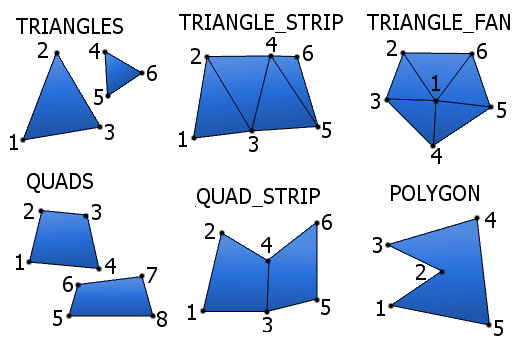
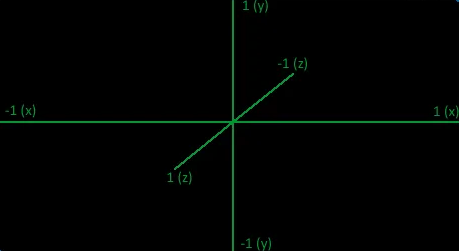

# Массив Вершинных Объектов
+ VAO (vertex array object)

> [!tip]
> VAO - это главный массив, он хранится в ГПУ, и его будет отрисовывать openGL\
> VAO может быть столько, на сколько памяти ГПУ хватит\
> Вызывать функции vao, можно только после определения контекста

есть два способа работать с VAO:

первый способ
```cpp
vao::create(float* data, int sizeOfByte);
vao::create(std::vector<float> data);
// обе функции загружают массив данных в ГПУ, и возвращают(unsigned int) номер этого массива
// первая функция принимает указатель на массив и его размер в байтах
// вторая функция принимает вектор

vao::addAttribute(unsigned int id, int index, int n, int size, int indentation);
// эта функция добавляет вершинный атрибут, что это такое поговорим в главе про них
// id - это номер массива в ГПУ
// index - это номер вершинного атрибута
// n - кол-во элементов для данного атрибута
// size - кол-во элементов на вершину
// indentation - смещение в массиве(то есть, с какого элемента начнётся атрибут) 

vao::Delete(unsigned int id);
// удаляет vao по его номеру

vao::DeleteALL();
// удаляет все vao

vao::bind(unsigned int id);
// включает vao по его номеру

vao::draw(primitive Primitive, int first_vert, int count_vert);
// рисует включенный vao
// принимает вид примитива, про их виды я напишу в конце этой главы
// принимает номер первой вершины, и номер последней вершины

vao::draw(primitive Primitive, unsigned int VAO, int first_vert, int count_vert);
// рисует vao (включает его автоматически)
// принимает номер vao
// принимает вид примитива, про их виды я напишу в конце этой главы
// принимает номер первой вершины, и номер последней вершины
```

второй способ

```cpp
// v - это объект, можно использовать любое другое название

VAO v(float* data, int sizeOfByte, int elementToVert);
VAO v(std::vector<float> data, int elementToVert);
// оба этих конструктора загружают массив данных в ГПУ и создают объект v

// первый конструктор принимает указатель на массив, 
// его размер в байтах и кол-во элементов на одну вершину

// вторая конструктор принимает вектор и кол-во элементов на одну вершину

v.addAttribute(int index, int n, int indentation);
// эта функция добавляет вершинный атрибут, что это такое поговорим в главе про них
// index - это номер вершинного атрибута
// n - кол-во элементов для данного атрибута
// indentation - смещение в массиве(то есть, с какого элемента начнётся атрибут) 

v.~VAO();
// этот деструктор удаляет vao
// можно также использовать функцию vao::DeleteALL(); она также удалит все vao

v.draw(primitive Primitive, int first_vert = 0, int count_vert = 0);
// рисует vao 
// принимает вид примитива, про их виды я напишу в конце этой главы
// принимает номер первой вершины, и номер последней вершины

// если последние два параметра не указать,
// то функция нарисует все вершины которые находятся в данном vao
```

## ПРИМИТИВЫ 

> [!WARNING]
> Обратите внимание в каком порядке рисуются вершины\
> QUADS, QUAD_STRIP, POLYGON в новой openGL, почему-то не работают
> 

## Координаты в openGL
> [!WARNING]
> Обратите внимание как задаются координаты в openGL\
> в openGL ось z повёрнута в противоположную сторону, это надо учесть
> 
> 

+ [дальше](shader.md)
+ [назад](GraphicСooker.md) 
+ [в оглавление](manual.md)
